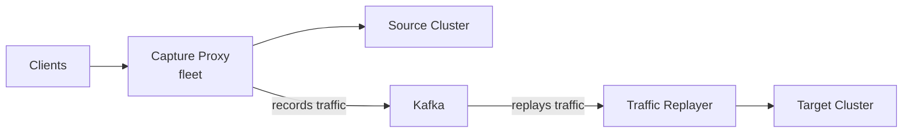

# Website Design Document — OpenSearch Migrations EKS Release

> **Version:** 1.0  
> **Date:** 2026-04-04  
> **Status:** Draft  
> **Based on:** Scraped content from docs.opensearch.org, GitHub Wiki, GitHub repo, and observability.opensearch.org

---

## 1. Project Overview

### Purpose

A dedicated website for the **OpenSearch Migrations EKS Release** — the Kubernetes-native deployment of Migration Assistant for OpenSearch. This site consolidates the official documentation (28 pages on docs.opensearch.org), the GitHub Wiki (14 pages focused on EKS/K8s workflows), and repo infrastructure into a single, purpose-built resource for teams deploying and operating migrations on EKS.

### Target Audience

| Audience | Needs |
|----------|-------|
| **Platform Engineers** | EKS deployment, Helm charts, CloudFormation, IAM configuration |
| **DevOps / SRE Teams** | Workflow orchestration, monitoring, troubleshooting, scaling |
| **Migration Engineers** | End-to-end migration execution, metadata/backfill/replay workflows |
| **Technical Decision Makers** | Migration path evaluation, architecture understanding, risk assessment |
| **Application Developers** | Client compatibility, query migration, field type transformations |

### Goals

1. Provide a complete, self-contained guide for deploying Migration Assistant on EKS
2. Unify content from official docs (CDK/ECS-focused) and wiki (K8s/Helm-focused) into a coherent narrative
3. Document all three migration scenarios with EKS-specific instructions
4. Deliver a modern, dark-themed site inspired by observability.opensearch.org
5. Follow docs.opensearch.org formatting conventions for content consistency

---

## 2. Content Inventory

### 2.1 Official Documentation Pages (28 pages from docs.opensearch.org)

| # | Page Title | URL Path | Key Content |
|---|-----------|----------|-------------|
| 1 | Migration Assistant for OpenSearch | `/migration-assistant/` | Overview of three migration aspects: metadata, backfill, live traffic |
| 2 | Architecture | `/migration-assistant/architecture/` | AWS Cloud architecture diagram, ALB + Capture Proxy + MSK + RFS pipeline |
| 3 | Is Migration Assistant Right for You? | `/migration-assistant/is-migration-assistant-right-for-you/` | Version compatibility matrix (ES 1.x–8.x → OS 1.x–3.x), supported platforms, feature support table, checklist |
| 4 | Key Components | `/migration-assistant/key-components/` | Migration Console, Traffic Capture Proxy, Traffic Replayer, Metadata Migration Tool, RFS, Target Cluster |
| 5 | Migration Console | `/migration-assistant/migration-console/` | ECS task hosting CLI tools for migration phases |
| 6 | Accessing the Migration Console | `.../accessing-the-migration-console/` | `accessContainer.sh` script, SSM Session Manager access, stage configuration |
| 7 | Migration Console Command Reference | `.../migration-console-command-reference/` | Full CLI: `console clusters`, `console backfill`, `console snapshot`, `console metadata`, `console replay`, `console tuples` |
| 8 | Migration Phases | `/migration-assistant/migration-phases/` | Three scenarios with ordered step lists |
| 9 | Assessment | `.../migration-phases/assessment/` | Breaking changes tool, data transformation impact, supported transformations |
| 10 | Backfill | `.../migration-phases/backfill/` | RFS start/scale/monitor/pause/stop, CloudWatch dashboard, validation queries |
| 11 | Create Snapshot | `.../migration-phases/create-snapshot/` | `console snapshot create`, status checking, slow snapshot management |
| 12 | Deploy | `.../migration-phases/deploy/` | CDK-based: Bootstrap EC2 → IAM → CDK build → RFS deploy → verify stacks |
| 13 | Configuration Options | `.../deploy/configuration-options/` | `cdk.context.json` for RFS, C&R, auth (none/basic/sigv4), snapshot options |
| 14 | IAM and Security Groups | `.../deploy/iam-and-security-groups-for-existing-clusters/` | OpenSearch Service security group config, cross-managed-cluster role mapping |
| 15 | Verifying Backfill Components | `.../deploy/verifying-backfill-components/` | S3 repository plugin, snapshot verification, IMDSv1 workaround |
| 16 | Verifying Live Capture Components | `.../deploy/verifying-live-capture-components/` | Traffic Replayer verification, Kafka topic checks, ALB switchover |
| 17 | Migrate Metadata | `.../migration-phases/migrate-metadata/` | `console metadata evaluate` and `migrate`, troubleshooting, compatibility mode |
| 18 | Transform Field Types | `.../migrate-metadata/handling-field-type-breaking-changes/` | JavaScript transformation framework, `field-type-converter.js`, `transformation.json` |
| 19 | Transform Type Mappings | `.../migrate-metadata/handling-type-mapping-deprecation/` | `TypeMappingsSanitizationTransformer`, static/regex mappings, ES 6.x multi-type |
| 20 | Transform dense_vector → knn_vector | `.../migrate-metadata/transform-dense-vector-knn-vector/` | Automatic ES 7.x → OS knn_vector, similarity mapping, HNSW config |
| 21 | Transform flattened → flat_object | `.../migrate-metadata/transform-flattened-flat-object/` | Automatic ES 7.3+ → OS 2.7+ flat_object |
| 22 | Transform string → text/keyword | `.../migrate-metadata/transform-string-text-keyword/` | Automatic ES 1.x–5.x string conversion based on index property |
| 23 | Migrating Metadata (redirect) | `.../migration-phases/migrating-metadata/` | Empty — likely redirect |
| 24 | Remove Migration Infrastructure | `.../migration-phases/remove-migration-infrastructure/` | `cdk destroy`, manual cleanup, S3 bucket removal |
| 25 | Replay Captured Traffic | `.../migration-phases/replay-captured-traffic/` | Replayer start/stop/status, time scaling, Jolt transforms, tuple logs, CloudWatch |
| 26 | Reroute to Capture Proxy | `.../migration-phases/reroute-source-to-proxy/` | ALB routing, NLB→ALB→Cluster, Kafka verification, Host header config |
| 27 | Reroute to Target | `.../reroute-traffic-from-capture-proxy-to-target/` | ALB weight switching, target proxy scaling, fallback procedure |
| 28 | Security Patching and Updating | `/migration-assistant/security-patching-and-updating/` | OS patching, Docker cache clearing, Gradle clean, image rebuild |

### 2.2 GitHub Wiki Pages (14 pages — EKS/K8s focused)

| # | Page Title | Key Content |
|---|-----------|-------------|
| 1 | Home | K8s-native workflow-driven approach, `kubectl exec` access, `workflow configure sample` |
| 2 | What Is a Migration | Three aspects, RFS internals (Lucene segment files), three scenarios, iterative workflows |
| 3 | Architecture | EKS architecture diagram, workflow steps with approval gates, Argo Workflows |
| 4 | Migration Paths | Version matrix, platform support including OpenSearch Serverless targets |
| 5 | Deploying to Kubernetes | Generic K8s: Helm 3, namespace `ma`, K8s secrets for auth (basic/mTLS/SigV4) |
| 6 | Deploying to EKS | `aws-bootstrap.sh`, CloudFormation, `--deploy-create-vpc-cfn`, stage naming, IAM access entries |
| 7 | Workflow CLI Overview | Declarative YAML, Argo orchestration, approval gates, `workflow manage` TUI |
| 8 | Workflow CLI Getting Started | `workflow configure sample --load` → edit → create secrets → submit → monitor → approve |
| 9 | Backfill Workflow | Snapshot → Register → Metadata → RFS Load → Cleanup, index allowlists, parallelism |
| 10 | Capture and Replay Workflow | Proxy fleet → Kafka (Strimzi) → Replayer, zero-downtime, document ID requirements |
| 11 | Troubleshooting | Connectivity, auth, workflow failures, pod issues, performance tuning |
| 12 | Kiro AI Assistant | Bootstrap script for AI-guided migrations |
| 13 | _Sidebar | Navigation: Overview → Deployment → Running Migrations → Reference |
| 14 | _Footer | Issue tracking links |

### 2.3 EKS/Kubernetes-Specific Content (actual excerpts)

The wiki contains **56 EKS mentions** and **38 Kubernetes mentions**. Key excerpts:

**Deploying-to-EKS.md:**
> "This guide covers deploying Migration Assistant to Amazon Elastic Kubernetes Service (EKS) using CloudFormation and the bootstrap script."

**Home.md:**
> "Migration Assistant is a tool for migrating data from Elasticsearch and OpenSearch clusters to OpenSearch. It provides a Kubernetes-native, workflow-driven approach to orchestrate migrations using declarative YAML configuration."

**Architecture.md:**
> "Migration Assistant runs on Kubernetes and uses Argo Workflows for orchestration. The diagram below shows the architecture on AWS EKS, but Migration Assistant works equivalently on any Kubernetes distribution including GKE, AKS, OpenShift, and self-managed Kubernetes clusters."

**Backfill-Workflow.md:**
> "RFS runs multiple workers in parallel, each reading shard data directly from the snapshot in S3. Because workers read from object storage — not the source cluster — scaling up workers has zero impact on the source cluster."

**What-Is-A-Migration.md:**
> "Reindex-from-Snapshot (RFS) takes a fundamentally different approach. Instead of reading documents through the source cluster's HTTP API, it takes a one-time snapshot of the source cluster, reads the raw Lucene segment files directly from the snapshot in storage (S3), extracts documents, applies transformations, and bulk-indexes them on the target."

### 2.4 Repository Infrastructure (312 files)

| Category | Count | Key Paths |
|----------|-------|-----------|
| CDK (TypeScript) | ~80 | `deployment/cdk/opensearch-service-migration/lib/` — network-stack.ts, migration-assistance-stack.ts, capture-proxy-stack.ts, kafka-stack.ts, reindex-from-snapshot-stack.ts, traffic-replayer-stack.ts, stack-composer.ts |
| Helm Charts | ~60 | `deployment/k8s/charts/aggregates/migrationAssistantWithArgo/` — Chart.yaml, values.yaml, valuesEks.yaml, templates/ (migrationConsole.yaml, workerFleets.yaml, workflowRbac.yaml) |
| Dockerfiles | 12 | migrationConsole/Dockerfile, captureProxyBase/Dockerfile, otelCollector/Dockerfile, grafana/Dockerfile, k8sConfigMapUtilScripts/Dockerfile, DocumentsFromSnapshotMigration/docker/Dockerfile |
| K8s Resources | ~30 | OTel collectors, Gatekeeper constraints, S3 bucket jobs, Grafana dashboards, Kyverno policies |
| Jenkins CI | ~15 | eksIntegTestCover.groovy, k8sLocalIntegTestCover.groovy, k8sMatrixTestCover.groovy |
| CloudFormation | ~10 | `deployment/k8s/aws/` — aws-bootstrap.sh, assemble-bootstrap.sh |
| Solutions CDK | ~20 | `deployment/migration-assistant-solution/lib/` — eks-infra.ts, solutions-stack-eks.ts |
| Dashboards | 2 | capture-replay-dashboard.json, reindex-from-snapshot-dashboard.json |

### 2.5 Supported Migration Paths

**Source → Target Compatibility Matrix** (from official docs):

| Source | → OS 1.x | → OS 2.x | → OS 3.x |
|--------|----------|----------|----------|
| ES 1.x | ✓ | ✓ | ✓ |
| ES 2.x | ✓ | ✓ | ✓ |
| ES 5.x | ✓ | ✓ | ✓ |
| ES 6.x | ✓ | ✓ | ✓ |
| ES 7.x | ✓ | ✓ | ✓ |
| ES 8.x | — | ✓ | ✓ |
| OS 1.x | — | ✓ | ✓ |
| OS 2.x | — | ✓ | ✓ |

**Supported Platforms:** Self-managed (cloud/on-prem), Amazon OpenSearch Service, Amazon OpenSearch Serverless (target only), Elastic Cloud, AWS EC2.

**Performance Benchmarks** (from repo README, tested 2025-03-10):

| Service | vCPU | Memory | Peak Docs/min | Primary Shard Rate (MBps) |
|---------|------|--------|---------------|---------------------------|
| RFS | 2 | 4 GB | 590,000 | 15.1 |
| RFS (w/ type mapping) | 2 | 4 GB | 546,000 | 14.0 |
| Traffic Replay | 8 | 48 GB | 1,694,000 | 43.5 |
| Traffic Replay (w/ type mapping) | 8 | 48 GB | 1,645,000 | 42.2 |

### 2.6 Key Components

| Component | Description | EKS Deployment |
|-----------|-------------|----------------|
| **Migration Console** | CLI for all migration operations. Provides `console` and `workflow` commands. | StatefulSet `migration-console-0` in namespace `ma` |
| **Workflow CLI** | Declarative YAML config: `workflow configure`, `submit`, `manage`, `status`, `approve` | Runs inside Migration Console pod |
| **Argo Workflows** | K8s-native workflow engine with parallel execution, retry logic, approval gates | Deployment (server + controller) in `ma` |
| **Capture Proxy** | HTTP proxy fleet forwarding to source while recording to Kafka. Stateless. | K8s Deployment with Service (NLB on EKS) |
| **Traffic Replayer** | Reads from Kafka, replays against target with transforms. Supports speedup factor. | K8s Deployment |
| **RFS** | Document migration via raw Lucene segment files from S3 snapshots. 1 worker/shard max. | K8s Jobs managed by Argo |
| **Metadata Migration Tool** | Migrates index settings, mappings, templates, aliases. Auto field type transforms. | Runs inside Migration Console |
| **Kafka (Strimzi)** | Durable message queue for traffic capture. Auto-managed or external. | Strimzi operator or external |

---

## 3. Information Architecture

### 3.1 Proposed Site Structure

Based on the wiki sidebar structure and official docs hierarchy, the site follows a task-oriented flow:

```
/                                    ← Landing page (hero + overview)
├── /overview/
│   ├── what-is-a-migration/         ← Wiki: What-Is-A-Migration.md
│   ├── architecture/                ← Wiki: Architecture.md + Official: architecture/
│   └── migration-paths/             ← Wiki: Migration-Paths.md + Official: is-migration-assistant-right-for-you/
│
├── /deployment/
│   ├── deploying-to-eks/            ← Wiki: Deploying-to-EKS.md (primary path)
│   ├── deploying-to-kubernetes/     ← Wiki: Deploying-to-Kubernetes.md (generic K8s)
│   ├── configuration-options/       ← Official: configuration-options/ (adapted for K8s)
│   └── iam-and-security/           ← Official: iam-and-security-groups/ + Wiki: Troubleshooting (auth)
│
├── /migration-guide/
│   ├── assessment/                  ← Official: assessment/
│   ├── create-snapshot/             ← Official: create-snapshot/
│   ├── migrate-metadata/            ← Official: migrate-metadata/
│   │   ├── field-type-transforms/   ← Official: handling-field-type-breaking-changes/
│   │   ├── type-mapping-transforms/ ← Official: handling-type-mapping-deprecation/
│   │   ├── dense-vector-knn/        ← Official: transform-dense-vector-knn-vector/
│   │   ├── flattened-flat-object/   ← Official: transform-flattened-flat-object/
│   │   └── string-text-keyword/     ← Official: transform-string-text-keyword/
│   ├── backfill/                    ← Official: backfill/ + Wiki: Backfill-Workflow.md
│   ├── capture-and-replay/          ← Official: replay-captured-traffic/ + Wiki: Capture-and-Replay-Workflow.md
│   ├── traffic-routing/             ← Official: reroute-source-to-proxy/ + reroute-to-target/
│   └── teardown/                    ← Official: remove-migration-infrastructure/
│
├── /workflow-cli/
│   ├── overview/                    ← Wiki: Workflow-CLI-Overview.md
│   ├── getting-started/             ← Wiki: Workflow-CLI-Getting-Started.md
│   └── command-reference/           ← Official: migration-console-command-reference/ (adapted)
│
├── /reference/
│   ├── troubleshooting/             ← Wiki: Troubleshooting.md + Official: deploy troubleshooting
│   ├── security-patching/           ← Official: security-patching-and-updating/
│   └── key-components/              ← Official: key-components/
│
├── /resources/
│   ├── releases/                    ← Links to GitHub Releases
│   ├── ci-dashboard/                ← Links to Jenkins CI: migrations.ci.opensearch.org
│   └── contributing/                ← Links to GitHub repo + contribution guide
│
└── /ai-assistant/                   ← Wiki: Kiro-AI-Assistant.md
```

### 3.2 Content Mapping (source → destination)

| Site Page | Primary Source | Secondary Source |
|-----------|---------------|------------------|
| Landing page | Wiki Home.md | Official overview page |
| What Is a Migration | Wiki What-Is-A-Migration.md | Official migration-phases/ |
| Architecture | Wiki Architecture.md | Official architecture/ |
| Migration Paths | Wiki Migration-Paths.md | Official is-migration-assistant-right-for-you/ |
| Deploying to EKS | Wiki Deploying-to-EKS.md | Official deploy/ (adapted) |
| Deploying to K8s | Wiki Deploying-to-Kubernetes.md | — |
| Workflow CLI Overview | Wiki Workflow-CLI-Overview.md | — |
| Workflow CLI Getting Started | Wiki Workflow-CLI-Getting-Started.md | — |
| Backfill Workflow | Wiki Backfill-Workflow.md | Official backfill/ |
| Capture and Replay | Wiki Capture-and-Replay-Workflow.md | Official replay-captured-traffic/ |
| Migrate Metadata | Official migrate-metadata/ | Wiki (metadata references) |
| Field Type Transforms | Official (5 transform pages) | — |
| Troubleshooting | Wiki Troubleshooting.md | Official deploy troubleshooting sections |
| Command Reference | Official command-reference/ | Wiki CLI commands |
| Releases | GitHub Releases page | — |
| CI Dashboard | Jenkins: migrations.ci.opensearch.org | — |
| Contributing | GitHub repo CONTRIBUTING.md | — |

### 3.3 Navigation Design

**Primary navigation** (fixed header):

```
[Logo] Overview ▾  Deployment ▾  Migration Guide ▾  Workflow CLI ▾  Reference ▾  Resources ▾  [GitHub] [Search]
```

**Resources dropdown**:
- [Releases](https://github.com/opensearch-project/opensearch-migrations/releases) — version downloads and changelogs
- [CI Dashboard](https://migrations.ci.opensearch.org/) — Jenkins build/test status
- [GitHub](https://github.com/opensearch-project/opensearch-migrations) — source code and issues

**Left sidebar** (docs pages): Follows wiki `_Sidebar.md` structure:

```
Migration Assistant - EKS
  1. Overview
  2. What Is a Migration
  3. Architecture
  4. Migration Paths

Deployment
  5. Deploying to Kubernetes
  6. Deploying to EKS

Running Migrations
  7. Workflow CLI Overview
  8. Workflow CLI Getting Started
  9. Backfill Workflow
  10. Capture and Replay Workflow

Reference
  11. Troubleshooting
```

### 3.4 Content Types (Diátaxis Framework)

| Type | Pages | Purpose |
|------|-------|---------|
| **Tutorials** | Workflow CLI Getting Started, Deploying to EKS | Learning-oriented, step-by-step |
| **How-to Guides** | Backfill Workflow, Capture and Replay, Migrate Metadata, Traffic Routing | Task-oriented, problem-solving |
| **Reference** | Command Reference, Migration Paths, Configuration Options, Key Components | Information-oriented, accurate |
| **Explanation** | What Is a Migration, Architecture | Understanding-oriented, conceptual |

---

## 4. Design System

### 4.1 Formatting Conventions (from docs.opensearch.org source analysis)

The official docs site uses **Jekyll 4.4.1** with **Just-the-Docs v0.3.3** theme and **kramdown** markdown engine.

#### Front Matter Patterns (actual examples from source)

```yaml
---
layout: default
title: Migration Assistant for OpenSearch
nav_order: 10
has_children: true
has_toc: false
parent: Migration phases
grand_parent: Migration Assistant
redirect_from:
  - /docs/migration-assistant/
---
```

Custom data fields for cards and steps:

```yaml
why_use:
  - heading: "Card title"
    description: "Card description"
    link: "/relative/path/"
    image: "/images/icons/icon.png"
    image_alt: "Alt text"

steps:
  - heading: "Step title"
    description: "Step description"
    link: "/path/"
```

#### Callout / Admonition Syntax (actual kramdown IAL patterns)

| Type | Syntax | Appearance |
|------|--------|------------|
| Note | `{: .note}` | Blue background, blue left border |
| Tip | `{: .tip}` | Green background, green left border |
| Important | `{: .important}` | Yellow background, yellow left border |
| Warning | `{: .warning}` | Red background, red left border |

**Single paragraph:**
```markdown
This is an important note about configuration.
{: .note}
```

**Multi-paragraph (blockquote):**
```markdown
>   **PREREQUISITE**
>
>   You need to install these plugins:
>   * Plugin A
>   * Plugin B
{: .note}
```

**Actual SCSS from source:**
```scss
%callout {
  border: 1px solid var(--border-color);
  border-radius: var(--border-radius-md);
  margin: var(--spacing-base) 0;
  padding: var(--spacing-base);
  position: relative;
}
.note      { @extend %callout; border-left: 5px solid var(--attention); background-color: var(--callout-note-bg); }
.tip       { @extend %callout; border-left: 5px solid var(--callout-tip-border); background-color: rgba(40, 192, 176, 0.08); }
.important { @extend %callout; border-left: 5px solid var(--callout-warning-border); background-color: rgba(255, 184, 28, 0.12); }
.warning   { @extend %callout; border-left: 5px solid var(--callout-error-border); background-color: rgba(221, 74, 105, 0.08); }
```

#### Code Block Patterns (actual includes from source)

**Copy button:**
````markdown
```bash
curl -XGET "localhost:9200/_tasks?actions=*search&detailed"
```

````

**Copy + cURL button (for API requests):**
````markdown
```json
PUT /sample-index1/_clone/cloned-index1
{
  "aliases": { "sample-alias1": {} }
}
```

````

**Tabbed multi-language code blocks:**
````markdown

PUT /hotels-index
{ "settings": { "index.knn": true } }



client.indices.create(index="hotels-index", body={"settings": {"index.knn": True}})



````

Supported tab languages: `rest`, `python`, `java`, `javascript`, `go`, `ruby`, `php`, `dotnet`, `rust`

#### Label / Badge Syntax (actual patterns)

```markdown
## Get roles
Introduced 1.0
{: .label .label-purple }
```

| Label | Syntax | Color |
|-------|--------|-------|
| Blue | `{: .label .label-blue}` | Default blue |
| Green | `{: .label .label-green}` | Success green |
| Purple | `{: .label .label-purple}` | API version purple |
| Red | `{: .label .label-red}` | Breaking change red |
| Yellow | `{: .label .label-yellow}` | Warning yellow |

#### Collapsible Sections (actual `<details>` pattern)

```html
<details open markdown="block">
  <summary>
    Response
  </summary>
  {: .text-delta}

  ```json
  { "_nodes": { "total": 1, "successful": 1, "failed": 0 } }
  ```
</details>
```

#### Table Formatting

```markdown
Parameter | Data type | Description
:--- | :--- | :---
`param_name` | String | Description of the parameter.
```

#### Link Patterns

```markdown
[Link text]({{site.url}}{{site.baseurl}}/path/to/page/)
```

Where `{{site.url}}` = `https://docs.opensearch.org` and `{{site.baseurl}}` = `/latest`.

#### Image Handling

```markdown

```

```html

```

### 4.2 Visual Design (from observability.opensearch.org CSS analysis)

The observability site uses **Astro** with **Tailwind CSS v4.1.18**, providing a modern dark-themed reference.

#### Color Palette (actual extracted values)

**Brand Colors (CSS Custom Properties):**
```css
--color-primary-400: #26c9ff;   /* Light cyan — links, highlights */
--color-primary-500: #00d4ff;   /* Primary cyan — CTAs, focus rings */
--color-secondary-500: #0099ff; /* Blue — secondary actions */
--color-accent-500: #00d4ff;    /* Accent elements */
```

**Body & Background:**
```css
body {
  background-color: #0a0e1a;     /* Deep navy-black */
  color: var(--color-slate-100); /* Near-white text */
}
```

**Dark Theme Palette (Tailwind Slate Scale — oklch):**

| Token | oklch Value | Hex Approx | Usage |
|-------|------------|------------|-------|
| `slate-950` | `oklch(12.9% .042 264.695)` | ~#0a0e1a | Primary background, hero, footer |
| `slate-900` | `oklch(20.8% .042 265.755)` | ~#0f172a | Alternating section backgrounds |
| `slate-800` | `oklch(27.9% .041 260.031)` | ~#1e293b | Card backgrounds, borders |
| `slate-700` | `oklch(37.2% .044 257.287)` | ~#334155 | Card borders, dividers |
| `slate-400` | `oklch(70.4% .04 256.788)` | ~#94a3b8 | Muted text |
| `slate-300` | `oklch(86.9% .022 252.894)` | ~#cbd5e1 | Secondary text, nav links |
| `slate-200` | `oklch(92.9% .013 255.508)` | ~#e2e8f0 | Emphasized body text |
| `slate-100` | `oklch(96.8% .007 247.896)` | ~#f1f5f9 | Primary body text |
| `white` | `#ffffff` | — | Headings, hover text |

**Accent Colors (usage frequency from HTML):**

| Color | Count | Usage |
|-------|-------|-------|
| `text-white` | 58 | Headings, hover states |
| `text-slate-300` | 48 | Body text, nav links |
| `text-slate-400` | 30 | Muted/secondary text |
| `text-cyan-400` | 21 | Accent text, links |
| `text-green-500` | 18 | Status indicators |
| `text-blue-300` | 11 | Code/technical text |
| `text-yellow-300` | 9 | Warning/highlight text |

**Inline SVG Icon Colors:**
```
#06b6d4 (cyan-500)    #10b981 (emerald-500)   #3b82f6 (blue-500)
#6366f1 (indigo-500)  #8b5cf6 (violet-500)    #ef4444 (red-500)
#f59e0b (amber-500)
```

**Gradient Patterns (actual CSS):**
```css
/* Hero gradient text */
background: linear-gradient(135deg, #00d4ff, #09f, #00b8e6);

/* Hero background orbs */
background: linear-gradient(135deg, #00d4ff, #09f);     /* orb-1 */
background: linear-gradient(135deg, #09f, #06b6d4);     /* orb-2 */
background: linear-gradient(135deg, #06b6d4, #00d4ff);  /* orb-3 */

/* CTA buttons */
bg-gradient-to-r from-emerald-500 to-green-600
bg-gradient-to-r from-emerald-600 to-green-500
```

#### Typography (actual font loading)

```html
<link href="https://fonts.googleapis.com/css2?family=Inter:wght@400;500;600;700&family=Fira+Code:wght@400;500&display=swap" rel="stylesheet">
```

```css
--font-sans: "Inter", system-ui, -apple-system, BlinkMacSystemFont, "Segoe UI", Roboto, sans-serif;
--font-mono: "Fira Code", "Monaco", "Courier New", monospace;
```

**Font Size Scale (actual Tailwind usage counts):**

| Class | Size | Usage Count | Purpose |
|-------|------|-------------|---------|
| `text-sm` | 0.875rem | 28 | Most-used body text |
| `text-lg` | 1.125rem | 22 | Secondary headings, descriptions |
| `text-xl` | 1.25rem | 11 | Card headings |
| `text-5xl` | 3rem | 11 | Hero/section headings |
| `text-3xl` | 1.875rem | 8 | Section headings |
| `text-2xl` | 1.5rem | 8 | Sub-section headings |

**Responsive Typography (actual patterns):**
- Hero heading: `text-5xl md:text-6xl lg:text-7xl`
- Section headings: `text-3xl md:text-5xl`
- Sub-headings: `text-xl md:text-3xl`
- Body: `text-sm md:text-base lg:text-lg`

#### Layout Patterns (actual Tailwind classes)

**Fixed header with backdrop blur:**
```html
<header class="fixed top-0 left-0 right-0 z-50 bg-slate-950/80 backdrop-blur-md border-b border-slate-800">
```

**Section pattern (alternating backgrounds):**
```html
<section class="py-20 px-6 bg-slate-900">
  <div class="max-w-7xl mx-auto">
    <h2 class="text-3xl md:text-5xl font-bold text-white text-center mb-4">
    <p class="text-slate-300 text-lg text-center max-w-3xl mx-auto mb-12">
    <div class="grid grid-cols-1 md:grid-cols-2 lg:grid-cols-3 gap-6">
```

**Card pattern (rounded-xl with border):**
```html
<div class="group block rounded-xl overflow-hidden border border-slate-700 bg-slate-950 hover:border-cyan-500/50 transition-all duration-300">
  <div class="p-6">
    <div class="w-14 h-14 rounded-xl bg-indigo-500/10 border border-indigo-500/20 flex items-center justify-center">
    <h3 class="text-xl font-bold text-white">
    <p class="text-slate-300 text-sm">
  </div>
</div>
```

**Container widths:**
```css
max-w-7xl mx-auto px-4 sm:px-6 lg:px-8  /* Primary — 80rem */
max-w-6xl                                 /* Secondary — 72rem */
max-w-3xl                                 /* Text content — 48rem */
```

**Grid patterns:**
```css
grid-cols-1 md:grid-cols-2 lg:grid-cols-3  /* Feature cards */
grid-cols-1 lg:grid-cols-2                  /* Two-column sections */
grid-cols-1 sm:grid-cols-2 md:grid-cols-4   /* Stats/metrics */
```

### 4.3 Component Library

#### Callouts (adapted for both sites)

**docs.opensearch.org style (kramdown):**
```markdown
Migration Assistant does not guarantee zero-downtime migration through live traffic Capture and Replay when migrating from Elasticsearch 1.x or Elasticsearch 2.x.
{: .warning}
```

**Astro/Tailwind equivalent:**
```html
<div class="border-l-4 border-red-500 bg-red-500/10 rounded-r-lg p-4 my-4">
  <p class="text-slate-200 text-sm">Migration Assistant does not guarantee...</p>
</div>
```

#### Code Blocks with Copy Button

**observability.opensearch.org pattern:**
```html
<div class="bg-slate-900/80 rounded-xl border border-slate-800 overflow-hidden">
  <div class="flex items-center justify-between px-4 py-2 bg-slate-800/50 border-b border-slate-700">
    <span class="text-slate-400 text-sm font-mono">filename.yaml</span>
    <button class="copy-button px-3 py-1 text-xs bg-slate-800 hover:bg-slate-700 text-slate-300 hover:text-white rounded transition-colors">
      Copy
    </button>
  </div>
  <pre class="p-4 overflow-x-auto"><code class="font-mono text-sm">...</code></pre>
</div>
```

#### Feature Cards (actual Tailwind classes)

```html
<div class="group block rounded-xl overflow-hidden border border-slate-700 bg-slate-950
            hover:border-cyan-500/50 transition-all duration-300">
  <div class="p-6">
    <div class="w-14 h-14 rounded-xl bg-cyan-500/10 border border-cyan-500/20
                flex items-center justify-center mb-4">
      <!-- SVG icon -->
    </div>
    <h3 class="text-xl font-bold text-white mb-2">Feature Title</h3>
    <p class="text-slate-300 text-sm leading-relaxed">Description text</p>
    <span class="text-cyan-400 text-sm group-hover:translate-x-1 transition-transform">
      Learn more →
    </span>
  </div>
</div>
```

#### Status Indicators and Version Badges

```html
<!-- Version badge (green) -->
<span class="inline-flex items-center px-2.5 py-0.5 rounded-full text-xs font-medium bg-green-500/10 text-green-400 border border-green-500/20">
  v2.0+
</span>

<!-- Status badge (cyan) -->
<span class="inline-flex items-center px-2.5 py-0.5 rounded-full text-xs font-medium bg-cyan-500/10 text-cyan-400 border border-cyan-500/20">
  EKS Release
</span>
```

#### Primary CTA Button (actual)

```html
<a class="inline-flex items-center gap-2 px-8 py-4 bg-cyan-500 hover:bg-cyan-400
          text-slate-900 font-semibold rounded-lg transition-colors duration-200">
  Get Started
</a>
```

#### Animated Background Orbs (actual hero pattern)

```html
<div class="absolute top-1/4 left-1/4 w-96 h-96 rounded-full opacity-20 blur-[80px]"
     style="background: linear-gradient(135deg, #00d4ff, #09f); animation: float 20s ease-in-out infinite;">
</div>
```

```css
@keyframes float { 0%, 100% { transform: translateY(0) rotate(0deg); } 50% { transform: translateY(-20px) rotate(180deg); } }
@keyframes gradient-shift { 0% { background-position: 0% 50%; } 50% { background-position: 100% 50%; } 100% { background-position: 0% 50%; } }
```

---

## 5. Technical Stack Recommendation

### 5.1 Comparison of Existing Sites

| Aspect | docs.opensearch.org | observability.opensearch.org |
|--------|--------------------|-----------------------------|
| **Framework** | Jekyll 4.4.1 | Astro (latest) |
| **Theme** | Just-the-Docs v0.3.3 | Custom |
| **CSS** | SCSS (27KB custom) | Tailwind CSS v4.1.18 |
| **Markdown** | kramdown | Astro MDX |
| **Fonts** | System + custom | Inter + Fira Code (Google Fonts) |
| **Dark Mode** | `data-skin="dark"` toggle | Dark-only |
| **Build** | Jekyll SSG | Astro SSG |
| **Navigation** | Collection-based sidebar | Fixed header + sidebar |
| **Code Blocks** | Jekyll includes (`copy.html`) | Custom components |
| **Hosting** | Static | Static |

### 5.2 Recommended Stack

**Astro + Tailwind CSS** — matching the observability site's modern stack while incorporating docs.opensearch.org content conventions.

| Layer | Choice | Rationale |
|-------|--------|-----------|
| **Framework** | Astro 5.x | SSG with MDX support, component islands, view transitions. Same as observability site. |
| **CSS** | Tailwind CSS v4 | Utility-first, matches observability site. Dark theme built-in. |
| **Content** | Astro Content Collections (MDX) | Type-safe frontmatter, markdown with components, supports kramdown-style callouts via custom components |
| **Fonts** | Inter (400–700) + Fira Code (400–500) | Matches observability site exactly |
| **Search** | Pagefind | Zero-config static search, lightweight |
| **Deployment** | GitHub Pages / S3 + CloudFront | Static hosting, CI/CD via GitHub Actions |
| **Analytics** | Google Tag Manager | Matches observability site |

### 5.3 Project Structure

```
website/
├── astro.config.mjs
├── tailwind.config.mjs
├── package.json
├── public/
│   ├── favicon.svg
│   ├── og-image.png
│   └── images/
│       ├── architecture/
│       │   └── eks-architecture.svg
│       └── icons/
├── src/
│   ├── layouts/
│   │   ├── BaseLayout.astro          # HTML shell, fonts, meta
│   │   ├── DocsLayout.astro          # Sidebar + content + TOC
│   │   └── LandingLayout.astro       # Full-width hero sections
│   ├── components/
│   │   ├── Header.astro              # Fixed nav with backdrop-blur
│   │   ├── Sidebar.astro             # Docs sidebar navigation
│   │   ├── Footer.astro              # Site footer
│   │   ├── TOC.astro                 # Table of contents
│   │   ├── Callout.astro             # Note/Tip/Important/Warning
│   │   ├── CodeBlock.astro           # Code with copy button
│   │   ├── TabbedCode.astro          # Multi-language tabs
│   │   ├── FeatureCard.astro         # Feature grid cards
│   │   ├── VersionBadge.astro        # Version/status labels
│   │   ├── CompatibilityMatrix.astro # Interactive version matrix
│   │   ├── MigrationScenario.astro   # Scenario step visualization
│   │   └── HeroOrbs.astro            # Animated background
│   ├── content/
│   │   ├── config.ts                 # Content collection schemas
│   │   └── docs/
│   │       ├── overview/
│   │       ├── deployment/
│   │       ├── migration-guide/
│   │       ├── workflow-cli/
│   │       └── reference/
│   ├── styles/
│   │   └── global.css                # Tailwind directives + custom
│   └── pages/
│       ├── index.astro               # Landing page
│       └── [...slug].astro           # Dynamic docs pages
└── .github/
    └── workflows/
        └── deploy.yml                # GitHub Actions CI/CD
```

### 5.4 Build and Deployment

```bash
# Development
npm install
npm run dev          # localhost:4321

# Production build
npm run build        # Outputs to dist/
npm run preview      # Preview production build

# Deploy (GitHub Actions)
# Triggered on push to main branch
# Builds with Astro, deploys to GitHub Pages
```

**GitHub Actions workflow:**
```yaml
name: Deploy
on:
  push:
    branches: [main]
jobs:
  build:
    runs-on: ubuntu-latest
    steps:
      - uses: actions/checkout@v4
      - uses: actions/setup-node@v4
        with: { node-version: 20 }
      - run: npm ci
      - run: npm run build
      - uses: actions/upload-pages-artifact@v3
        with: { path: dist }
  deploy:
    needs: build
    runs-on: ubuntu-latest
    permissions: { pages: write, id-token: write }
    environment: { name: github-pages }
    steps:
      - uses: actions/deploy-pages@v4
```

---

## 6. EKS-Specific Content Plan

### 6.1 All EKS Content Found Across Sources

**Wiki (56 EKS mentions across 10 pages):**

| Source Page | EKS Content |
|-------------|-------------|
| Deploying-to-EKS.md | Full EKS deployment guide: `aws-bootstrap.sh`, CloudFormation (create/import VPC), stage-based naming (`migration-eks-cluster-<STAGE>-<REGION>`), IAM access entries, security groups, kubectl access |
| Home.md | Architecture on EKS, `aws eks update-kubeconfig`, `kubectl exec -it migration-console-0 -n ma` |
| Architecture.md | EKS architecture diagram (`diagrams/eks-architecture.svg`), Argo Workflows on K8s |
| Troubleshooting.md | EKS security groups, `aws eks describe-cluster`, cluster security group ID lookup |
| Workflow-CLI-Overview.md | `aws eks update-kubeconfig` for kubectl context |
| Workflow-CLI-Getting-Started.md | EKS kubeconfig setup, K8s secrets creation |
| Capture-and-Replay-Workflow.md | NLB on EKS for proxy fleet routing |
| Backfill-Workflow.md | K8s node resources for worker scaling |
| Migration-Paths.md | Deploying to EKS link |
| Kiro-AI-Assistant.md | AI-guided EKS deployment |

**Repo Infrastructure (EKS-specific files):**

| Path | Purpose |
|------|---------|
| `deployment/k8s/aws/aws-bootstrap.sh` | EKS bootstrap script |
| `deployment/k8s/aws/assemble-bootstrap.sh` | Bootstrap assembly |
| `deployment/k8s/charts/aggregates/migrationAssistantWithArgo/valuesEks.yaml` | EKS-specific Helm values |
| `deployment/migration-assistant-solution/lib/eks-infra.ts` | EKS infrastructure CDK |
| `deployment/migration-assistant-solution/lib/solutions-stack-eks.ts` | EKS solutions stack |
| `jenkins/migrationIntegPipelines/eksIntegTestCover.groovy` | EKS integration tests |
| `jenkins/migrationIntegPipelines/eksAOSS*IntegTestCover.groovy` | EKS + OpenSearch Serverless tests |
| `jenkins/migrationIntegPipelines/eksBYOSIntegTestCover.groovy` | EKS bring-your-own-snapshot tests |
| `jenkins/migrationIntegPipelines/eksCreateVPCSolutionsCFNTestCover.groovy` | EKS VPC creation tests |
| `vars/eksIntegPipeline.groovy` | EKS integration pipeline |
| `vars/eksIsolatedDeploy.groovy` | EKS isolated deployment |
| `vars/eksSolutionsCFNTest.groovy` | EKS CloudFormation tests |

### 6.2 Argo Workflows Orchestration

From Wiki Architecture.md:
> "Configure and submit a migration workflow from the Migration Console:
> ```bash
> workflow configure edit    # Edit configuration
> workflow submit            # Submit to Argo Workflows
> ```
> The workflow orchestrates:
> 1. Point-in-time snapshot of the source cluster
> 2. Metadata migration (indexes, templates, component templates, aliases)
> 3. **Approval gate** — workflow pauses for user confirmation before document migration
> 4. Resource provisioning for Reindex-from-Snapshot (RFS) backfill
> 5. Resource scale-down when backfill completes"

From Wiki Workflow-CLI-Overview.md:
> "Argo Workflows provides: Parallel execution, Retry logic, Progress tracking, Resource management, Approval gates."

### 6.3 Helm Chart Structure (from repo tree)

```
deployment/k8s/charts/
├── aggregates/
│   ├── migrationAssistantWithArgo/
│   │   ├── Chart.yaml
│   │   ├── values.yaml                    # Default values
│   │   ├── valuesEks.yaml                 # EKS-specific overrides
│   │   ├── valuesForLocalK8s.yaml         # Local dev values
│   │   ├── fluentValues.yaml              # Fluent Bit logging
│   │   ├── ecrMirroringPlan.md            # ECR image mirroring
│   │   ├── scripts/
│   │   │   ├── generatePrivateEcrValues.sh
│   │   │   ├── mirrorToEcr.sh
│   │   │   └── privateEcrManifest.sh
│   │   ├── templates/
│   │   │   ├── NOTES.txt
│   │   │   ├── childrenChartInstaller/
│   │   │   │   ├── installJob.yaml
│   │   │   │   ├── permissions.yaml
│   │   │   │   └── uninstallJob.yaml
│   │   │   ├── helpers/
│   │   │   │   ├── _installHelper.tpl
│   │   │   │   ├── _s3Helper.tpl
│   │   │   │   └── _uninstallHelper.tpl
│   │   │   ├── installWorkflows.yaml
│   │   │   └── resources/
│   │   │       ├── argoArtifactRepository.yaml
│   │   │       ├── aws/
│   │   │       │   ├── awsMetadata.yaml
│   │   │       │   ├── gp3StorageClass.yaml
│   │   │       │   └── workloadsNodePool.yaml
│   │   │       ├── migrationConsole.yaml
│   │   │       ├── migrationCrds.yaml
│   │   │       ├── workerFleets.yaml
│   │   │       ├── workflowRbac.yaml
│   │   │       ├── otel/
│   │   │       │   ├── collectorFromOperator.yaml
│   │   │       │   ├── rbac.yaml
│   │   │       │   └── simpleCollectorAsIndependentDaemonset.yaml
│   │   │       ├── s3/
│   │   │       │   ├── createS3Bucket.yaml
│   │   │       │   ├── deleteS3Bucket.yaml
│   │   │       │   └── snapshotConfigMap.yaml
│   │   │       └── grafanaDashboard.yaml
│   │   └── other/
│   │       ├── gatekeeperConstraints.yaml
│   │       └── otelOperatorAutoInstrumentation.yaml
│   └── testClusters/
│       ├── Chart.yaml
│       ├── values.yaml
│       ├── valuesEks.yaml
│       └── templates/
└── components/
    └── buildImages/
        ├── Chart.yaml
        └── templates/
```

### 6.4 CDK Deployment Path (218 files — legacy/internal)

The CDK path deploys to ECS/Fargate (not EKS). Key stacks:

| Stack | File | Purpose |
|-------|------|---------|
| Network | `network-stack.ts` | VPC, subnets, NAT gateway |
| OpenSearch Domain | `opensearch-domain-stack.ts` | Target cluster provisioning |
| Migration Infra | `migration-assistance-stack.ts` | Core migration infrastructure |
| Capture Proxy | `capture-proxy-stack.ts` | Traffic capture proxy on ECS |
| Kafka | `kafka-stack.ts` | Amazon MSK for streaming |
| Migration Console | `migration-console-stack.ts` | Console on ECS Fargate |
| RFS | `reindex-from-snapshot-stack.ts` | RFS workers on ECS |
| Traffic Replayer | `traffic-replayer-stack.ts` | Replayer on ECS |
| Stack Composer | `stack-composer.ts` | Orchestrates all stacks |

> **Note:** The wiki has **zero CDK mentions** — the K8s/Helm path is the documented and recommended approach for the EKS release. CDK content from official docs should be adapted or clearly marked as the legacy ECS deployment path.

### 6.5 Kubernetes Deployment Architecture

From Wiki Deploying-to-EKS.md:

```
AWS CloudShell / Local Terminal
  └── aws-bootstrap.sh
       ├── CloudFormation Stack
       │   ├── VPC (create or import)
       │   ├── EKS Cluster: migration-eks-cluster-<STAGE>-<REGION>
       │   ├── IAM Roles (snapshot role, node role)
       │   └── S3 Bucket: migrations-default-<ACCOUNT>-<STAGE>-<REGION>
       └── Helm Chart Installation
            └── Namespace: ma
                 ├── argo-workflows-server (Deployment)
                 ├── argo-workflows-workflow-controller (Deployment)
                 └── migration-console-0 (StatefulSet)
```

Post-deployment verification:
```bash
aws eks update-kubeconfig --region <REGION> --name migration-eks-cluster-<STAGE>-<REGION>
kubectl get pods -n ma
# Expected:
# argo-workflows-server-xxxxxxxxx-xxxxx   1/1  Running
# argo-workflows-workflow-controller-xx   1/1  Running
# migration-console-0                     1/1  Running
```

### 6.6 Proposed EKS-Specific Pages

| Page | Content Source | Key Topics |
|------|---------------|------------|
| **EKS Quick Start** | Wiki: Deploying-to-EKS.md | Bootstrap script, CloudFormation, verify deployment, access console |
| **EKS Architecture** | Wiki: Architecture.md | EKS architecture diagram, Argo Workflows, component pods |
| **IAM & Security** | Wiki: Troubleshooting.md (auth) + Official: IAM page | EKS access entries, security groups, SigV4/basic/mTLS auth |
| **Workflow CLI Tutorial** | Wiki: Workflow-CLI-Getting-Started.md | `workflow configure sample --load` → submit → manage → approve |
| **Backfill on EKS** | Wiki: Backfill-Workflow.md | Index allowlists, parallelism tuning, K8s resource limits |
| **Capture & Replay on EKS** | Wiki: Capture-and-Replay-Workflow.md | Strimzi Kafka, proxy fleet, NLB routing |
| **Monitoring on EKS** | Repo: dashboards/ + Wiki: Troubleshooting.md | CloudWatch Container Insights, Grafana dashboards, OTel |
| **Troubleshooting EKS** | Wiki: Troubleshooting.md | Connectivity, pod issues, kubectl debugging, performance |

### 6.7 Architecture Diagrams Needed

| Diagram | Source | Format |
|---------|--------|--------|
| EKS Architecture Overview | Wiki: `diagrams/eks-architecture.svg` (referenced) | SVG |
| Migration Workflow (Argo) | Wiki: Architecture.md (5-step process) | Mermaid → SVG |
| Capture & Replay Data Flow | Wiki: Capture-and-Replay-Workflow.md (Mermaid source) | Mermaid → SVG |
| RFS Worker Architecture | Wiki: What-Is-A-Migration.md (RFS internals) | SVG |
| Network Topology (VPC/EKS) | Wiki: Deploying-to-EKS.md (CloudFormation) | SVG |
| Three Migration Scenarios | Wiki: What-Is-A-Migration.md (scenario flows) | SVG |

Mermaid source from Capture-and-Replay-Workflow.md:


---

## 7. Design Tokens / CSS Variables

### 7.1 Complete Token Set (based on observability site extracted values)

```css
:root {
  /* ── Fonts ── */
  --font-sans: "Inter", system-ui, -apple-system, BlinkMacSystemFont, "Segoe UI", Roboto, sans-serif;
  --font-mono: "Fira Code", "Monaco", "Courier New", monospace;

  /* ── Brand Colors ── */
  --color-primary-400: #26c9ff;
  --color-primary-500: #00d4ff;
  --color-secondary-500: #0099ff;
  --color-accent-500: #00d4ff;

  /* ── Backgrounds ── */
  --bg-body: #0a0e1a;
  --bg-section-primary: oklch(12.9% .042 264.695);    /* slate-950 */
  --bg-section-secondary: oklch(20.8% .042 265.755);  /* slate-900 */
  --bg-card: oklch(27.9% .041 260.031);                /* slate-800 */
  --bg-card-hover: oklch(27.9% .041 260.031);          /* slate-800 */
  --bg-code: rgba(15, 23, 42, 0.8);                    /* slate-900/80 */
  --bg-header: rgba(10, 14, 26, 0.8);                  /* body/80 */

  /* ── Borders ── */
  --border-default: oklch(37.2% .044 257.287);         /* slate-700 */
  --border-subtle: oklch(27.9% .041 260.031);          /* slate-800 */
  --border-accent: rgba(0, 212, 255, 0.5);             /* cyan-500/50 */

  /* ── Text ── */
  --text-heading: #ffffff;
  --text-primary: oklch(96.8% .007 247.896);           /* slate-100 */
  --text-secondary: oklch(86.9% .022 252.894);         /* slate-300 */
  --text-muted: oklch(70.4% .04 256.788);              /* slate-400 */
  --text-accent: #22d3ee;                               /* cyan-400 */
  --text-link: #26c9ff;                                 /* primary-400 */

  /* ── Callout Colors ── */
  --callout-note-bg: rgba(0, 212, 255, 0.08);
  --callout-note-border: #00d4ff;
  --callout-tip-bg: rgba(40, 192, 176, 0.08);
  --callout-tip-border: #10b981;
  --callout-important-bg: rgba(255, 184, 28, 0.12);
  --callout-important-border: #f59e0b;
  --callout-warning-bg: rgba(221, 74, 105, 0.08);
  --callout-warning-border: #ef4444;

  /* ── Status Colors ── */
  --color-success: #10b981;                             /* emerald-500 */
  --color-warning: #f59e0b;                             /* amber-500 */
  --color-error: #ef4444;                               /* red-500 */
  --color-info: #3b82f6;                                /* blue-500 */

  /* ── Spacing ── */
  --spacing-xs: 0.25rem;
  --spacing-sm: 0.5rem;
  --spacing-md: 1rem;
  --spacing-lg: 1.5rem;
  --spacing-xl: 2rem;
  --spacing-2xl: 3rem;
  --spacing-section: 5rem;

  /* ── Radii ── */
  --radius-sm: 0.25rem;
  --radius-md: 0.375rem;
  --radius-lg: 0.5rem;
  --radius-xl: 0.75rem;
  --radius-2xl: 1rem;
  --radius-full: 9999px;

  /* ── Shadows ── */
  --shadow-card: 0 4px 6px -1px rgba(0, 0, 0, 0.3);
  --shadow-card-hover: 0 10px 15px -3px rgba(0, 0, 0, 0.4);

  /* ── Transitions ── */
  --duration-fast: 200ms;
  --duration-normal: 300ms;
  --duration-slow: 500ms;
  --ease-default: cubic-bezier(0.4, 0, 0.2, 1);

  /* ── Focus ── */
  --focus-ring: 2px solid #00d4ff;
  --focus-ring-offset: 2px;
  --focus-glow: 0 0 0 3px rgba(0, 212, 255, 0.3);

  /* ── Z-Index ── */
  --z-header: 50;
  --z-sidebar: 40;
  --z-overlay: 30;
  --z-dropdown: 20;
}
```

### 7.2 Tailwind Config (based on actual classes found)

```javascript
// tailwind.config.mjs
export default {
  content: ['./src/**/*.{astro,html,js,jsx,md,mdx,svelte,ts,tsx,vue}'],
  darkMode: 'class',
  theme: {
    extend: {
      fontFamily: {
        sans: ['Inter', 'system-ui', '-apple-system', 'sans-serif'],
        mono: ['Fira Code', 'Monaco', 'Courier New', 'monospace'],
      },
      colors: {
        brand: {
          cyan: '#00d4ff',
          'cyan-light': '#26c9ff',
          blue: '#0099ff',
          navy: '#0a0e1a',
        },
      },
      animation: {
        'float': 'float 20s ease-in-out infinite',
        'gradient-shift': 'gradient-shift 8s ease infinite',
        'fade-in': 'fadeIn 0.6s ease-out',
        'fade-in-up': 'fadeInUp 0.5s ease-out',
        'spin-slow': 'spin-slow 3s linear infinite',
      },
      keyframes: {
        float: {
          '0%, 100%': { transform: 'translateY(0) rotate(0deg)' },
          '50%': { transform: 'translateY(-20px) rotate(180deg)' },
        },
        'gradient-shift': {
          '0%': { backgroundPosition: '0% 50%' },
          '50%': { backgroundPosition: '100% 50%' },
          '100%': { backgroundPosition: '0% 50%' },
        },
        fadeIn: {
          from: { opacity: '0', transform: 'translateY(30px)' },
          to: { opacity: '1', transform: 'translateY(0)' },
        },
        fadeInUp: {
          from: { opacity: '0', transform: 'translateY(20px)' },
          to: { opacity: '1', transform: 'translateY(0)' },
        },
      },
      backdropBlur: {
        md: '12px',
      },
    },
  },
}
```

### 7.3 Light Mode Tokens (optional future support)

If light mode is added later, map from opensearch.org brand colors:

```css
:root[data-theme="light"] {
  --bg-body: #f4f8fb;
  --bg-section-primary: #ffffff;
  --bg-section-secondary: #f4f8fb;
  --bg-card: #ffffff;
  --border-default: #ccd3d6;
  --text-heading: #003b5c;
  --text-primary: #1a1a1a;
  --text-secondary: #4a5568;
  --text-muted: #718096;
  --text-accent: #005eb8;
  --text-link: #0085b8;
  --color-primary-500: #005eb8;     /* opensearch.org primary blue */
  --color-secondary-500: #00a3e0;   /* opensearch.org light blue */
}
```

---

## 8. Accessibility & Performance

### 8.1 WCAG Targets

| Criterion | Target | Implementation |
|-----------|--------|----------------|
| Color Contrast | WCAG 2.1 AA (4.5:1 body, 3:1 large text) | Slate-100 on slate-950 = ~15:1 ✓; Cyan-400 on slate-950 = ~8:1 ✓ |
| Keyboard Navigation | Full keyboard access | Focus rings: `outline: 2px solid #00d4ff; outline-offset: 2px` (from observability site) |
| Screen Readers | Semantic HTML + ARIA | `<main>`, `<nav>`, `<article>`, `<section>`, `<footer>` (matches observability site) |
| Skip Links | Skip to main content | `.skip-to-main` (absolute positioned, visible on focus — from observability site) |
| Touch Targets | 44×44px minimum | `min-width: 44px; min-height: 44px` on interactive elements (from observability site) |
| Motion | Respect user preference | Full `prefers-reduced-motion` support (from observability site) |

### 8.2 `prefers-reduced-motion` Support (actual pattern from observability site)

```css
@media (prefers-reduced-motion: reduce) {
  *, *::before, *::after {
    animation-duration: 0.01ms !important;
    animation-iteration-count: 1 !important;
    transition-duration: 0.01ms !important;
    scroll-behavior: auto !important;
  }
}
```

### 8.3 Performance Budgets

| Metric | Target | Strategy |
|--------|--------|----------|
| First Contentful Paint | < 1.5s | Static HTML, critical CSS inlined |
| Largest Contentful Paint | < 2.5s | Optimized images, font preloading |
| Total Blocking Time | < 200ms | Minimal JS, Astro islands for interactivity |
| Cumulative Layout Shift | < 0.1 | Font display swap, explicit image dimensions |
| Total Page Weight | < 500KB (initial) | Tailwind purging, image optimization |
| JavaScript Bundle | < 50KB | Astro partial hydration, no framework runtime |

### 8.4 SEO Considerations

**Meta tags (following observability site pattern):**
```html
<title>OpenSearch Migration Assistant — EKS Deployment Guide</title>
<meta name="description" content="Deploy and operate OpenSearch migrations on Amazon EKS. Kubernetes-native workflow orchestration for Elasticsearch to OpenSearch migrations.">
<meta property="og:type" content="website">
<meta property="og:image" content="/og-image.png">
<meta property="twitter:card" content="summary_large_image">
<link rel="canonical" href="https://migrations.opensearch.org/">
```

**Structured data:**
```json
{
  "@context": "https://schema.org",
  "@type": "SoftwareApplication",
  "name": "OpenSearch Migration Assistant",
  "applicationCategory": "DeveloperApplication",
  "operatingSystem": "Kubernetes"
}
```

**Sitemap:** Auto-generated by Astro (`@astrojs/sitemap`).

---

## 9. Raw Research Data Index

### 9.1 Source Files

| # | File | Size | Lines | Content |
|---|------|------|-------|---------|
| 1 | `/tmp/migration-assistant-content.md` | 152 KB | 4,129 | All 28 official docs pages from docs.opensearch.org/latest/migration-assistant/ |
| 2 | `/tmp/wiki-all-content.md` | 80 KB | 2,304 | All 14 GitHub Wiki pages (EKS deployment, Workflow CLI, architecture) |
| 3 | `/tmp/wiki-research-summary.md` | ~8 KB | 189 | Analysis of wiki content with EKS findings, repo infrastructure summary |
| 4 | `/tmp/wiki-eks-matches.md` | ~12 KB | 293 | Keyword grep results: EKS (56), Kubernetes (38), AWS (54), deploy (60), Helm (10) |
| 5 | `/tmp/osm-readme.md` | ~8 KB | 161 | Main repo README: overview, migration paths, performance benchmarks |
| 6 | `/tmp/osm-infra-files.txt` | ~15 KB | 312 | Infrastructure file paths: CDK, Helm, Dockerfiles, Jenkins, K8s resources |
| 7 | `/tmp/formatting-research.md` | ~25 KB | 654 | docs.opensearch.org formatting: Jekyll, kramdown, callouts, labels, code blocks, includes |
| 8 | `/tmp/observability-research.md` | ~20 KB | 500 | observability.opensearch.org: Astro+Tailwind, colors, typography, components, animations |

### 9.2 Key Statistics

| Metric | Value |
|--------|-------|
| Total pages scraped (official docs) | 28 |
| Total wiki pages scraped | 14 |
| Total content volume | ~320 KB of markdown |
| Total lines of content | ~7,542 |
| EKS keyword frequency (wiki) | 56 matches across 10 files |
| Kubernetes keyword frequency (wiki) | 38 matches across 10 files |
| AWS keyword frequency (wiki) | 54 matches across 12 files |
| Deploy keyword frequency (wiki) | 60 matches across 14 files |
| Helm keyword frequency (wiki) | 10 matches across 5 files |
| Infrastructure files in repo | 312 |
| Dockerfiles found | 12 |
| CDK stack files | ~80 |
| Helm chart files | ~60 |
| Jenkins pipeline files | ~15 |
| Supported source versions | ES 1.x–8.x, OS 1.x–2.x |
| Supported target versions | OS 1.x, 2.x, 3.x |
| Migration scenarios documented | 3 (backfill only, live capture only, combined) |
| CLI commands documented | 20+ (`console` and `workflow` namespaces) |
| Field type transformations | 5 (string→text/keyword, flattened→flat_object, dense_vector→knn_vector, type mappings, custom JS) |

---

## 10. References

### 10.1 Source URLs

| Source | URL |
|--------|-----|
| Official Documentation | https://docs.opensearch.org/latest/migration-assistant/ |
| GitHub Wiki | https://github.com/opensearch-project/opensearch-migrations/wiki |
| GitHub Repository | https://github.com/opensearch-project/opensearch-migrations |
| GitHub Releases | https://github.com/opensearch-project/opensearch-migrations/releases |
| Jenkins CI Dashboard | https://migrations.ci.opensearch.org/ |
| Observability Site | https://observability.opensearch.org/ |
| opensearch.org (brand) | https://opensearch.org/brand |
| docs.opensearch.org (source) | https://github.com/opensearch-project/documentation-website |
| AWS Solutions Page | https://aws.amazon.com/solutions/implementations/migration-assistant-for-amazon-opensearch-service/ |

### 10.2 Frameworks and Tools

| Tool | Version | Purpose |
|------|---------|---------|
| Astro | 5.x | Static site generator (recommended) |
| Tailwind CSS | v4.x | Utility-first CSS framework |
| Inter | 400–700 | Primary sans-serif font |
| Fira Code | 400–500 | Monospace font for code |
| Pagefind | Latest | Static search |
| Argo Workflows | Latest | K8s workflow orchestration (documented component) |
| Helm | 3.x | K8s package manager (documented component) |
| Jekyll | 4.4.1 | docs.opensearch.org SSG (reference only) |
| Just-the-Docs | v0.3.3 | docs.opensearch.org theme (reference only) |
| kramdown | Latest | docs.opensearch.org markdown engine (reference only) |

### 10.3 Key Documentation Files in Repo

| File | Size | Topic |
|------|------|-------|
| `docs/Architecture.md` | 40 KB | Detailed architecture |
| `docs/MigrationAsAWorkflow.md` | 46 KB | Workflow-driven migration design |
| `docs/workflowTreeDisplayDesign.md` | 49 KB | Workflow tree UI design |
| `docs/replayerArchitecture.md` | 39 KB | Traffic replayer internals |
| `docs/reconfiguringWorkflows.md` | 32 KB | Workflow reconfiguration |
| `docs/ScalingTrafficCaptureAndReplayer.md` | 26 KB | Scaling guidance |
| `docs/TrafficCaptureAndReplayDesign.md` | 22 KB | Capture/replay design |
| `docs/migration-console.md` | 15 KB | Console architecture |
| `docs/captureProxyTls.md` | 6 KB | TLS configuration |
| `docs/ClientTrafficSwinging.md` | 5 KB | Traffic cutover |
| `docs/LuceneCompatibility.md` | 2 KB | Lucene version compatibility |

---

*End of Design Document*
